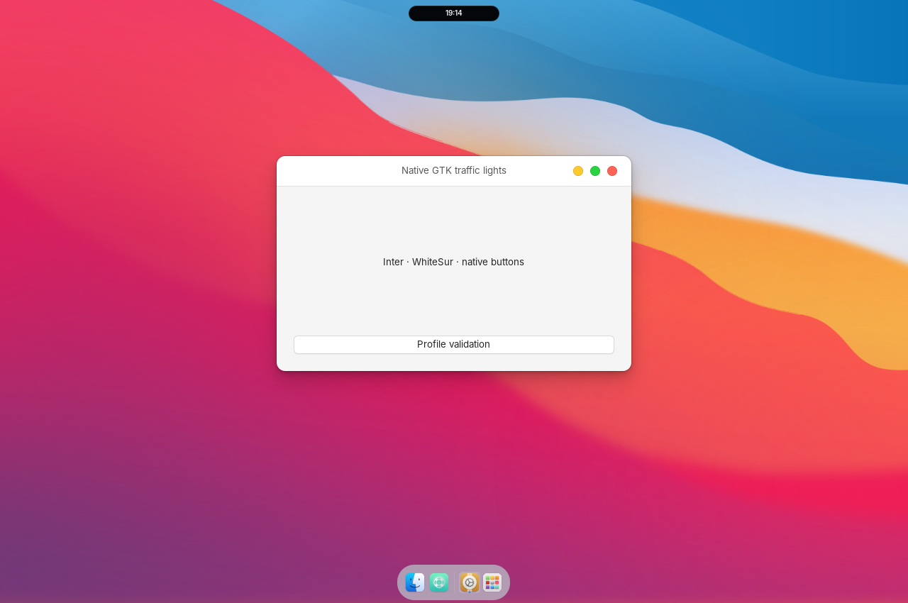

<div align="center">

# Island Desktop for GNOME

**A complete Ubuntu desktop look, with Dynamic Island at its center.**

Light application themes · Floating dock · Music-responsive wallpaper · Media controls · Optional offline Laya monitoring


[Install](#choose-your-installation) · [Desktop guide](docs/DESKTOP.md) · [Laya](#optional-offline-assistant) · [Validation](docs/VALIDATION.md) · [Report an issue](https://github.com/endrymagolas-wq/gnome-dynamic-island/issues)

</div>



*Native GNOME 46 preview from an isolated compositor. Audio features were injected to validate the wallpaper rendering; this is a desktop fixture, not a recording of a daily-use session.*

## Your desktop, brought together

Island Desktop combines the shell, application appearance, dock, wallpaper and media controls into one coordinated GNOME setup. Start with the full look, then adjust it to your taste. A smaller installation is available if you only want the island and its shell integration.

Built for **Ubuntu 24.04 / GNOME Shell 46 / Wayland**. Tested on Ubuntu 24.04.5. The interface currently uses **Ukrainian labels**. This beta supports GNOME 46 only.

| Part of the desktop | What you get |
| --- | --- |
| **Appearance** | Light GTK3/GTK4 application themes, matching icons, Inter typography and traffic-light window buttons. |
| **Dock & wallpaper** | A floating bottom dock, bundled wallpaper and optional music-responsive Layerlight waves. |
| **Dynamic Island** | A centered clock that becomes a compact media control with album art and animated playback indicators. |
| **Sound & focus** | Desktop and phone-volume feedback, per-application audio controls, a focus timer and notification history. |
| **Media & phone** | Netflix/YouTube browser-app launchers, an optional Netflix phone remote and optional AirPlay receiver integration. |
| **Laya** | Optional local monitoring for disk space, sustained CPU/RAM pressure, long tasks, downloads, network changes and service failures. |

Custom-titlebar overlays cover configured Codex/ChatGPT, Claude and Antigravity profiles. Application appearance and controls depend on compatibility; see the [desktop guide](docs/DESKTOP.md).

## Choose your installation

Both options currently use the same repository or [release archive](https://github.com/endrymagolas-wq/gnome-dynamic-island/releases). The commands below select what gets installed.

| Option | Includes | Command |
| --- | --- | --- |
| **Full desktop** | Island and shell integration, light application themes, icons, Inter, dock, wallpaper, waves and browser-player launchers. | `python3 install.py install --desktop` |
| **Island & shell** | Island, Ink shell theme, compatibility window controls and assistant helpers; keeps the rest of your desktop appearance. | `python3 install.py install` |

**Laya, AirPlay receiver setup and the phone remote are optional.** Laya and the phone remote start OFF on a fresh installation. Ordinary MPRIS media controls work without them.

### 1. Get the project

Check `gnome-shell --version` first. KDE, Hyprland and other shells are unsupported; keep GNOME's version validation enabled.

```sh
sudo apt install git python3 python3-venv gnome-shell-extensions
git clone https://github.com/endrymagolas-wq/gnome-dynamic-island.git
cd gnome-dynamic-island
```

### 2. Install the full desktop

On Ubuntu 24.04, install the desktop-profile dependencies, preview the changes, then install:

```sh
sudo apt install python3-gi gir1.2-gtk-3.0 gnome-shell-extension-ubuntu-dock \
  pipewire-bin fontconfig qrencode
python3 install.py install --desktop --dry-run
python3 install.py install --desktop
```

For the smaller **island & shell** option instead:

```sh
python3 install.py install --dry-run
python3 install.py install
```

### 3. Load your new desktop

Save your work, then **log out and back in** to load the new JavaScript. The installer prints a recovery manifest: keep its path for [restoring your previous setup](#restore--remove). Disable conflicting top-bar/autohide extensions such as Hide Top Bar before testing.

The appearance assets install offline. Replaced files are backed up and changed settings are recorded. `--no-activate` copies files without changing desktop settings or services. See the [full desktop guide](docs/DESKTOP.md) for browser requirements, optional receivers, phone pairing and compatibility details.

## Make it yours

Use GNOME's appearance settings and your dock's settings to adjust fonts, wallpaper and dock preferences. The top-panel moon control selects automatic, calm or energetic wallpaper motion and its intensity; you can switch waves off. Island desktop controls provide focus, audio, notification and assistant settings.

The profile uses ordinary GNOME settings and installed theme/extension files. Further theme changes can be made in those files; there is no all-in-one visual theme editor in this beta. Restore retains later per-key appearance choices; manually edited installed source files cause restore to stop before overwriting them.

## Optional offline assistant

### Laya: keep an eye on resources while you work

Local models, builds and parallel development tasks can put pressure on RAM, CPU and disk space. Laya classifies observed system events and surfaces short notices for supported conditions, so you can spot resource pressure or service failures while working on a project.

Monitoring includes sustained CPU/RAM pressure, disk-space changes, long tasks, downloads and network changes. Notices respect fullscreen/focus contexts, category muting and a maximum of three notices per five minutes. The assistant recommends actions; it does not close applications, kill other processes, delete files or run model-selected commands. Its economic mode releases the owned model process after 60 seconds idle. Full OFF disables its service and monitoring; manual diagnosis and media controls remain available.

The assistant starts **OFF on a fresh install**. Existing preferences are retained when reinstalling.

```sh
python3 setup_assistant.py
export PATH="$HOME/.local/bin:$PATH"
island-assistant on
island-assistant status
island-assistant off
```

Setup explicitly downloads CPU Python dependencies, a pinned [Laya multilingual checkpoint](https://huggingface.co/convaiinnovations/laya), and its tokenizer/configuration files. Internet is needed during setup; normal inference runs offline. The model weights alone are about 644 MB; allow several GB of disk space for Python dependencies and around 2 GB RAM for the loaded model. The lightweight collector uses substantially less memory when Laya sleeps. CPU and memory limits apply to the owned assistant service.

Python 3.10+ is required for model setup; Python 3.11 was used for the actual inference checks. `python3 setup_assistant.py --python /path/to/python3.11` selects another interpreter. The full tested runtime freeze is in `assistant/requirements.lock`; the installer pins the principal SDK/runtime versions. It is not a promise that every future dependency combination works.

Open the island, then its desktop controls, for assistant settings, category muting, diagnosis, history and application audio. `island-assistant diagnose` works with the assistant OFF. The actual service is `island-assistant.service`:

```sh
systemctl --user status island-assistant.service
journalctl --user -u island-assistant.service -n 30
```

## AirPlay and media players

Ordinary MPRIS players do not require the assistant or AirPlay. Receiver support is integration with separately installed software: [Shairport Sync](https://github.com/mikebrady/shairport-sync) for audio and [UxPlay](https://github.com/FDH2/UxPlay) for screen mirroring. Follow their upstream installation instructions. The phone and receiver must be on the same LAN.

This beta recognizes existing user units named `ytmusic-airplay.service` (audio) and `airplay-screen.service` (screen). The optional `--receivers` installation configures user units after `setup_receivers.py`; see the desktop guide. Shairport needs its D-Bus/MPRIS metadata support for phone track data, artwork and volume. A phone audio receiver is selected in the phone's audio AirPlay menu; screen mirroring uses a separate receiver. No firewall rules or network configuration are changed by this installer.

## Restore / remove

Use the exact manifest path printed during installation:

```sh
python3 install.py restore /absolute/path/to/manifest.json
```

Original files are restored, newly installed package files removed, and unchanged desktop settings reverted. Modified source files cause restore to stop before overwriting them. Later assistant preference changes and personal history/model caches are preserved. Save work and log out/back in after restoring. To switch off quickly, disable `airplay-island@avalon.local` and `island-window-controls@avalon.local` in GNOME Extensions, then run `island-assistant off`.

If upgrading the earlier local prototype, the installer disables its old window-controls UUID to avoid duplicate overlays. Existing old prototype assistant files/services are not migrated automatically: switch the old assistant off before enabling this separate public version.

## Privacy and limits

Monitoring reads system metrics, same-user process names/PIDs/start times, coarse NetworkManager connectivity, the watched user services, and top-level download names/size/mtime to detect stable files. Download contents, screenshots, command lines, environment variables, keystrokes and browser histories are not collected. Some UI media artwork may be downloaded from the URL supplied by an MPRIS player. No analytics or cloud model API is included.

Status, preferences and the last 60 notices stay in `~/.local/share/island-desktop/assistant/` with private file permissions. Logs can contain local process or service names; inspect and redact them before filing a public issue. OFF stops the owned classifier and collector, not other applications or media receivers.

See [validation and known limitations](docs/VALIDATION.md). Physical sleep/resume/lock reliability and broad monitor, scaling and application compatibility remain open beta checks. Task disappearance does not prove successful completion. Per-process RSS may count shared pages more than once. Displayed advice is conservative and requires the user's own decision.

## Development

```sh
python3 tests/run.py
python3 -m compileall -q assistant install.py setup_assistant.py
find extensions -name '*.js' -exec node --check {} \;
```

Node 22+ is needed for development tests and the optional Netflix phone remote. There are no npm runtime dependencies. Native rendering needs GNOME 46; portable tests do not stand in for compositor or physical-device verification.

Code is GPL-3.0-or-later; upstream theme notices are retained. See [third-party notices](THIRD_PARTY_NOTICES.md). This project is unofficial and is not affiliated with Apple, GNOME, Ubuntu or the Laya authors.

### Claude Code worker

An optional animated worker builds while Claude edits, inspects tests, waves for permissions and drinks coffee when finished. See [setup and event mapping](docs/CLAUDE.md).
