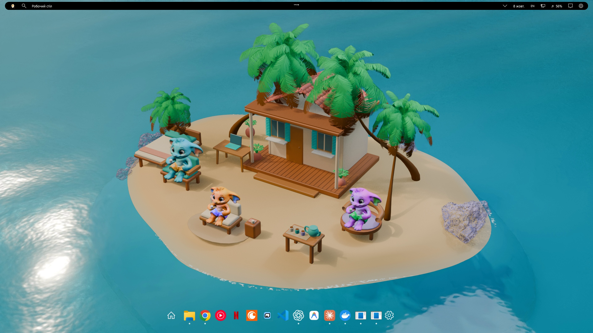
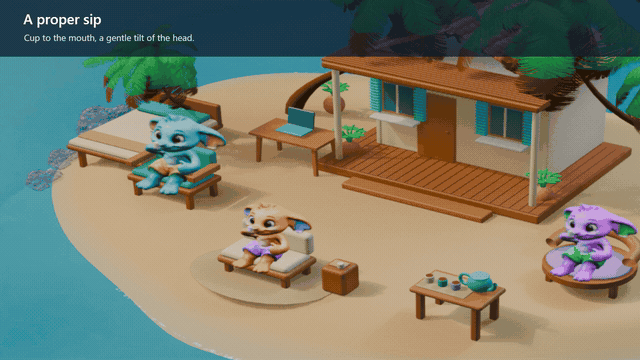
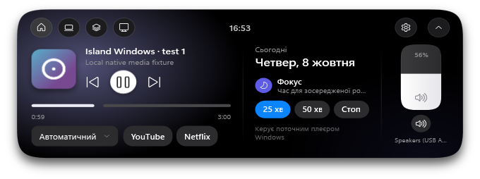
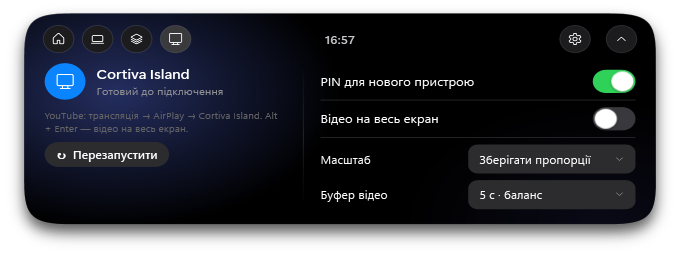

# Island Desktop

**A Dynamic Island, a floating dock, phone media and a living island for your desktop.**

The Windows edition brings the top bar, dock and media controls together in Cortiva Ink. Add AirPlay to play music and supported YouTube video from your iPhone or iPad, or Fairy Lagoon V7 for three little companions with their own places to work and relax. The original GNOME edition includes a coordinated Ubuntu desktop appearance.



*Product preview composed from the shipped scene renderer and actual native Windows panel captures.*

[Watch the Windows demo](https://github.com/endrymagolas-wq/gnome-dynamic-island/releases/download/windows-v0.4.0-beta.1/island-desktop-windows-demo.mp4) · [Downloads](https://github.com/endrymagolas-wq/gnome-dynamic-island/releases/tag/windows-v0.4.0-beta.2) · [Windows quick start, українською](docs/WINDOWS_RELEASE.md) · [GNOME guide](docs/DESKTOP.md)

## Windows, brought together

| Part | What you get |
| --- | --- |
| **Island and top bar** | A clock capsule expands at the top edge. Apps, window search, calendar, language, network, audio and settings use rounded Ink panels. |
| **Floating dock** | Pinned and running applications, launch/focus/minimize, window lists and running indicators. Fixed icon sizes, a soft hover highlight and a short panel fade. The top arrow opens the genuine Windows background-icon panel and its context menus. |
| **Media** | Artwork, track information, player selection, playback, seeking, system volume and per-application audio through Windows SMTC and Core Audio. |
| **AirPlay** | Receive phone music and supported direct YouTube video. PIN pairing, an independent video window, supported playback/seek controls, aspect options and adjustable buffering. |
| **Fairy Lagoon V7** | A larger island, three private nooks, a shared daybed and tea table. The companions walk, sit, drink, lie down, scratch their bellies and brew tea. Morning, day, evening and night follow the PC clock. |
| **Everyday controls** | Focus timer, app volume/mute, optional playback-responsive indicator, animation, hover, display and startup preferences. |

The island is a native WPF application. Fairy Lagoon runs in Lively Wallpaper using pre-rendered color/depth animation and 12-second water loops; Blender is needed only to edit and render the source scene. The dock uses installed applications and their icons. Third-party desktop applications and browser accounts are not included.

## Downloads

Release **[windows-v0.4.0-beta.2](https://github.com/endrymagolas-wq/gnome-dynamic-island/releases/tag/windows-v0.4.0-beta.2)** offers a complete bundle and separate components:

| Download | Includes | Start after extraction |
| --- | --- | --- |
| [Full Windows desktop](https://github.com/endrymagolas-wq/gnome-dynamic-island/releases/download/windows-v0.4.0-beta.2/island-desktop-windows-full-0.4.0-beta.2.zip) | Island, top bar, dock, media, AirPlay and V7 wallpaper; .NET and Python included. | `IslandDesktop-Windows-Full/Start-Desktop.cmd` |
| [Windows island](https://github.com/endrymagolas-wq/gnome-dynamic-island/releases/download/windows-v0.4.0-beta.2/island-desktop-windows-0.4.0-beta.2.zip) | Island, top bar, dock and media; .NET included. Receiver and wallpaper are separate. | `IslandDesktop-Windows/IslandDesktop.exe` |
| [AirPlay receiver](https://github.com/endrymagolas-wq/gnome-dynamic-island/releases/download/windows-v0.4.0-beta.1/cortiva-airplay-windows-0.4.0-beta.1.zip) | Standalone UxPlay/GStreamer receiver and its dependencies, licenses and source. | `Cortiva-AirPlay-Windows/Start-AirPlay.cmd` |
| [Fairy Lagoon V7 wallpaper](https://github.com/endrymagolas-wq/gnome-dynamic-island/releases/download/windows-v0.4.0-beta.1/fairy-lagoon-v7-wallpaper-windows.zip) | V7 runtime assets and a local host; Python included. | `FairyLagoon-V7-Windows/Start-Wallpaper.cmd` |
| [Editable Blender source](https://github.com/endrymagolas-wq/gnome-dynamic-island/releases/download/windows-v0.4.0-beta.1/fairy-lagoon-v7-blender-sources.zip) | Scene, character actions, build/render scripts and notices. | Open the `.blend` files in Blender. |
| [Native dependency source](https://github.com/endrymagolas-wq/gnome-dynamic-island/releases/download/windows-v0.4.0-beta.1/cortiva-airplay-native-corresponding-sources-0.4.0-beta.1.zip) | Exact corresponding sources/recipes for the shipped native receiver libraries; separate from the runtime bundle. | For source/license review and rebuilding. |

Already using beta 1? The [small app update](https://github.com/endrymagolas-wq/gnome-dynamic-island/releases/download/windows-v0.4.0-beta.2/island-desktop-windows-app-update-0.4.0-beta.2.zip) replaces only the application and its package metadata. Close the island and follow the included `DOCK_UPDATE.md`; retain your receiver, wallpaper and runtimes. Unchanged components remain available from beta 1.

**Lively Wallpaper is an external dependency** for the wallpaper and full bundle. The core island and standalone receiver do not need it. Keep every extracted package's subfolders together. See [Windows installation](docs/INSTALL_WINDOWS.md), [AirPlay](docs/AIRPLAY_WINDOWS.md) and [V7](docs/WALLPAPER_V7.md) for setup and removal.

The corresponding [project source archive](https://github.com/endrymagolas-wq/gnome-dynamic-island/archive/refs/tags/windows-v0.4.0-beta.2.zip) contains Windows and GNOME code, installers and production scripts. UxPlay source and local changes are included with the receiver; exact native dependency sources are offered as the separate download above, without duplicating them in the full runtime bundle. [Archive checksums](https://github.com/endrymagolas-wq/gnome-dynamic-island/releases/download/windows-v0.4.0-beta.2/SHA256SUMS).

| Platform | Support boundary |
| --- | --- |
| **Windows** | Native x64 beta; tested on Windows 11 Pro x64, build 26200. Windows 10, ARM64 and every DPI/monitor arrangement are not validated. |
| **Linux** | Ubuntu 24.04 / GNOME Shell 46 / Wayland; tested on Ubuntu 24.04.5. This installer supports GNOME 46 only. KDE and Hyprland are unsupported. |

## Phone music and video

For the full Windows bundle, enable the receiver in **System → AirPlay**. The standalone receiver shows its PIN in its console. Put the phone and PC on the same LAN and choose **Cortiva Island**:

- **Music:** select it in the player's AirPlay output menu.
- **YouTube video:** cast button → **AirPlay / Bluetooth devices** → **Cortiva Island**. The supported direct-video path opens a PC video window.

A real iPhone was used to confirm audible music, audio after PIN pairing and moving YouTube video with sound. Artwork, playback commands and seek support depend on what the source sends. Buffer choices are targets, not a fixed-latency guarantee. DRM services and every iOS application/version are outside the tested scope. [Connection and firewall instructions](docs/AIRPLAY_WINDOWS.md).

## Fairy Lagoon V7

Pip has a mint chair on the west side, the Codex companion a rounded violet nook beneath the eastern palm, and the app companion a low cream seat on the front beach. The shared daybed and tea table have reservations; routes and body clearance keep the characters from occupying the same furniture.

The three channels react to coarse local activity. Optional Claude Code hooks provide explicit task events; Codex and other applications also use process/focus inference. This is an activity display, not access to an assistant's internal thoughts. Hooks send bounded states, not prompts, tool commands or file contents. Eating and facial mouth/eyelid animation have not been implemented.



The product preview illustrates the scene and panels. Any staged media fixtures in the demo are labeled; a preview is separate from native playback and physical phone evidence. [V7 details and editable source](docs/WALLPAPER_V7.md).

### Native Windows panels





[Download all screenshots](https://github.com/endrymagolas-wq/gnome-dynamic-island/releases/download/windows-v0.4.0-beta.1/island-desktop-windows-screenshots.zip). The demo is a silent 55-second, 1920×1080 H.264 video at 30fps.

## GNOME desktop

The Linux profile combines light GTK3/GTK4 themes, matching icons, Inter, traffic-light window controls, a floating Ubuntu Dock, a light wallpaper and Layerlight waves driven by system playback. The island supplies MPRIS controls, per-app audio, phone-volume feedback, focus tools and notification history. Custom-titlebar profiles depend on application compatibility.

The interface currently uses Ukrainian labels. Disable conflicting top-bar/autohide extensions before testing. Check `gnome-shell --version` and keep the installer's version validation enabled.

From this repository or the extracted source archive:

```bash
sudo apt install git python3 python3-venv gnome-shell-extensions

# Full appearance profile dependencies
sudo apt install python3-gi gir1.2-gtk-3.0 gnome-shell-extension-ubuntu-dock \
  pipewire-bin fontconfig qrencode

# Preview changes, then install
python3 install.py install --desktop --dry-run
python3 install.py install --desktop
```

For a smaller installation that keeps the rest of your desktop appearance:

```bash
python3 install.py install --dry-run
python3 install.py install
```

Save your work, log out and log back in to load the extension. The installer prints a recovery manifest; retain its path. Appearance assets are installed offline, replaced files are backed up and changed settings are recorded. `--no-activate` copies files without changing settings or starting services.

The separate GNOME cartoon wallpaper uses one worker and its own cached-frame player. Install with `python3 install_wallpaper.py`; see [setup](docs/CLAUDE.md). Windows V7 has a different runtime and is not advertised as a native GNOME V7 port.

Optional Linux receivers, browser players and Netflix phone remote are documented in the [desktop guide](docs/DESKTOP.md). Linux audio uses Shairport Sync; supported video uses a separately built, patched UxPlay. The Linux installer does not alter firewall/router policies.

### Optional offline Laya

Laya monitors supported resource, task, download, connectivity and service events and offers short recommendations. It starts **OFF** on a fresh installation. It does not delete files, close other applications or execute model-selected commands.

```bash
python3 setup_assistant.py
export PATH="$HOME/.local/bin:$PATH"
island-assistant on
island-assistant status
island-assistant off
```

Setup needs internet to download pinned Python dependencies and the model; inference then runs offline. The model weights are about 644 MB. Allow several GB of disk for dependencies and around 2 GB RAM for the loaded model. Python 3.10+ is required; actual inference was checked with Python 3.11. Economic mode releases the owned model after 60 seconds idle. Notices are limited to three per five minutes. `island-assistant diagnose` works with the assistant OFF.

Monitoring reads system metrics, coarse same-user process/service information and top-level download names/size/mtime. It does not read download contents, keystrokes, browser history, command lines or environment variables. Preferences and recent notices remain under `~/.local/share/island-desktop/assistant/`; redact local process/service names before publishing logs. See [Linux validation](docs/VALIDATION.md).

## Restore and privacy

On Windows, use the package's stop action and switch off any startup preference before removing its folder. The island restores the previous taskbar state on exit; its launcher also handles island crashes. The full bundle's stop action closes its own wallpaper entry and restores the captured previous Lively layout; standalone wallpaper has a restore action. Pairing keys and preferences stay in local user data.

Restore a GNOME installation using the manifest printed by its installer:

```bash
python3 install.py restore /absolute/path/to/manifest.json
```

Restore reinstates original files and unchanged settings, retains later preferences and stops before overwriting manually edited installed source. Save work and log out/back in afterward.

Optional Windows audio response and Linux Layerlight analyze system playback, not microphone input, and do not save raw audio. Windows does not install GNOME themes, Linux Laya or the Netflix phone remote. Local suppression of Seelen flyouts on the development PC is not a portable feature that disables every Windows popup.

Physical sleep/resume/lock, exclusive fullscreen, broad monitor/scaling combinations and every third-party player remain separate beta checks. [Release evidence and limitations](docs/RELEASE_VALIDATION.md) distinguish automated checks, browser previews, native operation and physical phone verification.

## Source and licenses

Project code is **GPL-3.0-or-later**. Third-party runtime, theme, font and artwork licenses are preserved: [general notices](THIRD_PARTY_NOTICES.md), [Windows notices](windows/THIRD_PARTY_NOTICES.md), [asset provenance](art/ASSET_SOURCES.md).

Development commands and build dependencies: [Windows](windows/README.md), [GNOME desktop](docs/DESKTOP.md), [Linux validation](docs/VALIDATION.md). This is an unofficial project with no affiliation to Apple, Microsoft, GNOME, Ubuntu or the Laya authors.
