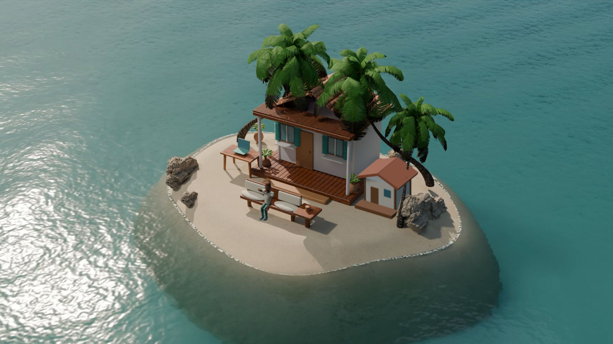

# Blender resort wallpaper on Windows

This is a full-screen wallpaper, independent of the GNOME Dynamic Island panel.
The original GNOME extension remains available; it cannot run natively on Windows.

## Start on this PC

```powershell
pwsh -NoProfile -File wallpaper/launch.ps1 -InstallHooks
```

Requires Python 3.10+ and Lively Wallpaper. The launcher starts a small loopback
server, preserves existing Claude hooks, installs a Lively library entry and
checks Lively's persisted layout before reporting success. Restart Claude Code
after adding its hooks. No Blender, After Effects or live 3D renderer is needed
while the wallpaper is running. The host is not added to Windows startup.

The installed Microsoft Store version redirects its library to LocalCache.
The launcher handles that mapping. It downloads the official Lively command
utility v2.0.4.0 into `%LOCALAPPDATA%/ResortIsland/lively-cli`, because the tested
v2.2.1.0 utility throws an immutable-constructor exception on `setwp` here.
It does not downgrade Lively itself. The prior wallpaper layout is backed up
to `%LOCALAPPDATA%/ResortIsland/previous-layout.json`.

Use Lively's Customize controls to turn water off or choose 720p. Closing the
wallpaper in Lively reveals the ordinary desktop wallpaper. To restore the
previous Lively wallpaper, select its entry in the library; the backup records
its exact library path. To remove our hooks, remove only entries whose command
references this repository's `assistant/claude_hook.py`; keep unrelated hooks.

Open `http://127.0.0.1:18765/wallpaper/index.html?preview=1` for manual reaction
controls. The actual desktop URL omits those controls.
The preview ignores desktop coverage so it can animate inside an application
window; hidden-page and reduced-motion pause still apply. The ordinary desktop
continues to honor coverage pause.

## Events and privacy

The existing `state_for()` Claude event mapping is reused. Windows delivery uses
an authenticated HTTP POST to `127.0.0.1:18765`, while Linux keeps its existing
D-Bus transport. Prompt text, paths, tool commands and tool output never leave
the hook. The host exposes bounded state names and scene playback diagnostics.
Its token stays in the current user's LocalAppData and is regenerated at launch.
Claude events take priority over ordinary focus for 180 seconds (20 for done).
Latest event wins across sessions, matching the existing behavior.

| Trigger | Scene |
| --- | --- |
| Task starts | Walk to outdoor laptop |
| Edit / Write tools | Type and increase guest-cabana stage (up to four) |
| Recognized test command starts | Walk to inspect the guest cabana |
| Test failure | Smoke and `блять…` |
| Permission request | Walk to front beach and wave |
| Task finishes | Sit at coffee bench |
| Editor / terminal focus | Work at desk |
| Browser focus | Visit the back of the island |
| Other program / desktop | Coffee |

Other applications can send explicit states with `python wallpaper/emit.py
testing` (or any documented state). Focus detection observes executable names,
not file contents or keystrokes; it does not infer that arbitrary applications
have edited files or passed tests.

## Layers and registration

- `poster.png`: still complete scene, used when water is off.
- `water-1080.mp4` / `water-720.mp4`: 12-second, 360-frame H.264 loops at 30 fps,
  rendered from displaced Blender water geometry. Transmission, shoreline,
  shading and reflections are evaluated together offline.
- `static.png`: the fixed island environment, rendered with a water holdout.
  It locks the interior land pixels over the compressed video. A height-based
  feathered shore mask exposes the baked moving shoreline and foam; the plate
  cannot freeze the beach/water intersection. Both retain the same camera.
- `character.png`: transparent Blender-rendered rig poses, eight walk headings,
  nine reactions and four construction stages.
- `construction-depth.png`: the cabana's real per-pixel depth offsets, one tile
  per stage. Its wide footprint is not treated as an upright sprite plane.
- `depth.png`: camera-space depth matte from the same scene. The player compares
  scene depth with the projected vertical character plane per pixel. It handles
  palms, rocks, furniture and the cottage rather than using screen-space guesses.
- `scene.json`: camera matrix, real ground targets, anchors and sprite scale.

The adapted Snow character moves along the elevated plateau and the organically
perturbed beach slope. Perspective position
and scale come from the Blender camera. Routes use clear beach corridors around
the cottage. The depth comparison approximates the character as a vertical
sprite plane; it is not a full animated per-pixel 3D depth volume. Dynamic character
reflections are not baked into the ocean, because the walkable paths are on land.
The soft contact shadow is composited at the projected ground point.

Seven-frame cyclic temporal filtering softens Cycles sampling grain while
preserving 30 rendered frames per second. Padding comes from the end of the same
cycle, so the filter does not reset at the seam. Geometry and foam use exact
12-second sine/cosine periods, with one normal 1/30-second step from last to first.
This is geometric water rendering, not deformation of a background photograph.
The shipped H.264 uses intra-only frames: the original predicted-frame encode
introduced a compression-quality jump at the loop boundary despite continuous
PNG inputs. `tools/check_resort_water.py` verifies the decoded shipped boundary
and all 360 frames, rather than checking only the raw render.

Lively's pause event stops video playback and actor scheduling. The Windows host
also checks lock/input-desktop availability and union coverage by opaque windows
over the primary work area. Page visibility and reduced motion stop animation.
Multi-monitor per-display lock/coverage and physical lock/resume require separate
manual validation; the observer currently targets this PC's primary display.

## Reproduce the render

Current source: `art/island/resort-v2.blend`, with Resort_Island, Character_V2,
Construction_Bake and Smoke_Bake scenes. Despite its v2 filename, this includes
the later v3 palms and coast. Required meshes and images are packed. The Snow
rig, weights, controls and ten task actions remain editable. See
[sources and credits](../art/ASSET_SOURCES.md). `resort.blend` is the preserved
earlier rejected prototype, not the current source.

The packed source is reproducible with Blender 4.5.9. The offline worker
regenerates static/transparent plates, depth with leaf alpha, 272 worker sprites,
construction, smoke and 361 water frames. Launch it through Blender MCP with
the current saved source (Windows example):

```python
import bpy, subprocess
from pathlib import Path
root = Path(bpy.data.filepath).parents[2]
log = open(root/'wallpaper/offline-render.log', 'w')
subprocess.Popen([
    bpy.app.binary_path, '--background', '--threads', '8',
    str(root/'art/island/resort-v2.blend'), '--python',
    str(root/'tools/render_resort_v3.py'), '--', 'final'
], stdout=log, stderr=log, creationflags=subprocess.CREATE_NO_WINDOW)
```

Then, with FFmpeg and Pillow installed:

```powershell
python tools/package_resort_v3.py
```

Frame 361 is the audit endpoint; it is excluded from the 360-frame video.
The packager rejects an incomplete render and checks all frame dimensions before
replacing the runtime bundle. Raw PNG sequences are retained locally but ignored
by Git. Runtime files and the editable `.blend` are versioned. Antigravity
downloaded licensed models; Nano Banana 2 generated art-direction and turnaround
references in Flow. Those references are not the animated water layer.
After Effects was not required; its exposed
MCP did not receive a reply from the local bridge panel during this run.

## Validation

```powershell
python tests/check_claude.py
python tests/check_resort_host.py
node tests/resort-scene.mjs
python tests/check_resort_depth.py
python tests/check_resort_construction_depth.py
python tools/check_resort_water.py
node tests/cartoon-island.mjs
```

The original full `tests/run.py` fails on Windows at `os.getuid()` in
`assistant/music_scene.py`. The same failure was reproduced on the untouched
PR baseline `14a163d37c7bb06d2455bd024383ac8b810effe1`; it is not a new regression.
See `docs/evidence/resort/` for measured results and remaining native checks.

Water uses offline Cycles/OptiX rendering: geometric periodic waves, periodically
advected fine bump normals, IOR 1.333, transmission, volume absorption and a
Nishita sky with a sun reflection. No runtime 3D shader is required.

## Measurements on this PC

Windows 11 Pro 10.0.26200, i9-9900K (16 logical CPUs), 32 GB RAM, RTX 3080
10 GB, primary display 1920×1080. Each CPU/GPU window lasted 30 seconds with
all owned Blender processes stopped. Scope includes the Lively core, the owned
WebView2 player and descendants, and the loopback event host.

| Mode | CPU % of whole PC | Mean summed RSS MiB | GPU 3D % | GPU decode % | Dedicated GPU MiB | Playback fps |
| --- | ---: | ---: | ---: | ---: | ---: | ---: |
| Same 720p water as video | 1.40 | 678 | 0.60 | 6.01 | 53 | 30.00 |
| Same 720p water as atlas | 2.79 | 883 | 1.89 | 0.00 | 335 | 25.01 |
| Still image | 0.09 | 605 | 0.00 | 0.00 | 53 | 0 |
| Full 1080p scene, coffee | 2.17 | 839 | 1.99 | 10.38 | 164 | 29.97 |
| Full 1080p scene, typing | 2.31 | 843 | 1.65 | 9.00 | 153 | 29.97 |
| Full scene, covered and paused | 0.32 | 753 | 0.00 | 0.00 | 147 | 0 |

Video is selected because it kept 30 decoded fps and used less CPU and memory
than the atlas. The atlas averaged about 40 ms between draws, with p95 about
117 ms. The decoded atlas occupies substantially more memory than its PNG files;
the browser's actual residency is reported above, rather than its theoretical
allocation. Shared GPU memory means were 11–30 MiB across these runs.

Active measurements temporarily used `--no-observer` and Lively's fullscreen
ignore setting because Codex covered the desktop. Both were restored before the
paused measurement and ordinary launch. The covered run held the decoded frame
counter at 4 throughout the interval, with video and actor scheduling paused.
Pause reduces processing; it retains loaded assets and GPU allocations.

RSS can double-count shared mappings. GPU columns are separate Windows engine
counters at the current clock, not total board utilization or power. Video fps
counts decoded frames; atlas fps counts draw submissions. Neither proves physical
monitor presentation. There were no additional reported dropped video frames in
the final video/full-scene measurement intervals. These are short measurements
on this PC, not a promise of zero load or all-day performance.

Evidence: [performance](evidence/resort/performance-v3.json),
[native reactions](evidence/resort/native-reactions.json),
[native controls](evidence/resort/native-controls.json),
[encoded seam](evidence/resort/encoded-water-v3.json),
[delivery hashes](evidence/resort/delivery-v3-manifest.json).
The geometry checks cover 104 beach samples, opaque/transparent palm leaves,
and 517 cabana depth samples. Ten editable actions and 1030 rig drivers were
retained. Native tests used synthetic hook payloads through the real transport;
they did not execute paid Claude tasks or real test commands.

Physical Win+L/resume, exclusive fullscreen games and per-display pause/resume
on multiple monitors remain manual checks. Native computer input was unavailable
in this session. Primary-desktop coverage and the native Lively pause callback
were observed and verified; do not extend that evidence to those untested cases.


